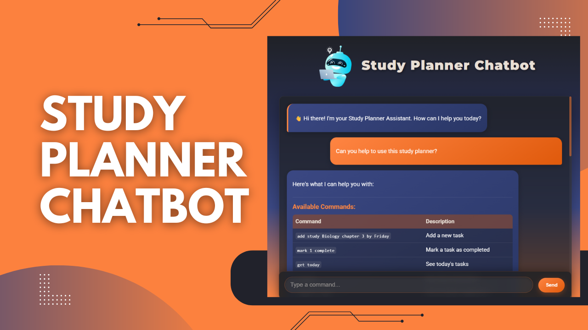

#     Study Planner Chatbot

   

<p align="center">
  
</p>

An interactive chatbot-style application that helps students manage their study tasks, track progress, and optimize their study schedule.

## ✨ Features

- 💬 Intuitive chat interface for task management
- 📝 Add new study tasks with subject, description, and due dates
- ✅ Mark tasks as completed
- 📅 View today's study schedule
- 📋 Track pending tasks
- ⏱️ Get smart study schedule suggestions based on available time
- 💾 Persistent storage of tasks using JSON

## 📽️ Demo
## 📽️ Demo
<p align="center">
  <a href="https://youtu.be/uHSlPiwI9Ok" title="Study Planner Chatbot Demo">
    
    <br>
    
  </a>
</p>

## 🚀 Installation

### Prerequisites

- Python 3.7 or higher
- pip (Python package installer)

### Step 1: Clone the repository

```bash
git clone https://github.com/your-username/study-planner-chatbot.git
cd study-planner-chatbot